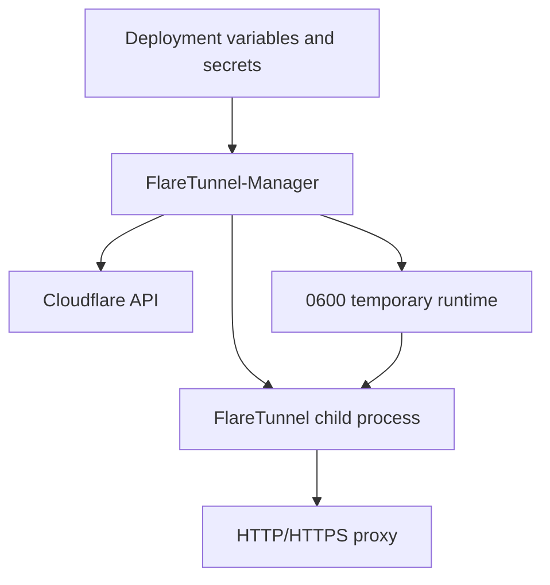

<div align="center">

# FlareTunnel-Manager

**Secure Go orchestrator for provisioning, reconciling, and running FlareTunnel in a reproducible image.**

[](https://go.dev/)
[](https://www.docker.com/)
[](https://developers.cloudflare.com/api/)
[](#security-model)

**[Français](README.md) · English**

</div>

FlareTunnel-Manager separates Cloudflare orchestration from the FlareTunnel proxy process. It validates configuration, reads the actual Worker state, performs bounded operations, prepares temporary credentials, and starts FlareTunnel with a minimal environment.

The Docker image is designed to be built once and run on a local host, a VPS, or an OCI-compatible PaaS.

## Architecture



The manager does not reimplement proxy behavior. It delegates management commands and tunnel operation to the FlareTunnel binary built from the commit pinned in the `Dockerfile`.

## Features

- **Reproducible image** for Docker, VPS, PaaS, and local execution.
- **Three explicit modes**: `create`, `delete`, and `use`.
- **Reconciliation against real Cloudflare state**, counting only `flaretunnel-*` Workers.
- **Bounded deletion**, never requesting more deletion than the configured quantity.
- **Controlled retries** and continued processing of later accounts after an error.
- **Strict validation** of account JSON arrays before any operation.
- **Proxy authentication** through `AUTH_PROXY`, converted to `AUTH_PROXY_BASIC` only for the child.
- **Separate MITM and transport certificates**, with key/certificate validation.
- **Ephemeral transport certificate**, generated from startup SAN values.
- **Credential and temporary-file cleanup**.
- **Embedded blocklists** selected by level instead of arbitrary user paths.

## Operating modes

| Mode | Active variable | Behavior |
| --- | --- | --- |
| `create` | `CF_CREATE_ACCOUNTS` | Reaches `target_workers` `flaretunnel-*` Workers per account. |
| `delete` | `CF_DELETE_ACCOUNTS` | Removes the requested number of existing Workers. `target_workers` is a deletion quantity. |
| `use` | `CF_USE_ACCOUNTS` | Discovers endpoints, prepares TLS, and starts the persistent proxy. |

Accounts are processed sequentially. In `create`, the manager calculates `missing = target_workers - existing`. In `delete`, each cleanup operation is capped by the number of Workers that actually exist.

## Configuration

### Required variables in `use` mode

```env
MODE=use
AUTH_PROXY={"username":"proxy-user","password":"REPLACE_WITH_A_STRONG_PASSWORD"}
CF_USE_ACCOUNTS=[{"name":"main","api_token":"CLOUDFLARE_API_TOKEN","account_id":"CLOUDFLARE_ACCOUNT_ID"}]
FLARETUNNEL_MITM_CA_KEY_B64=BASE64_ENCODED_RSA_PRIVATE_KEY
FLARETUNNEL_TRANSPORT_CA_KEY_B64=BASE64_ENCODED_RSA_PRIVATE_KEY
FLARETUNNEL_TLS_SAN=proxy.example.com 203.0.113.42
```

For `create`, replace `CF_USE_ACCOUNTS` with `CF_CREATE_ACCOUNTS` and add `target_workers`. For `delete`, use `CF_DELETE_ACCOUNTS` and interpret `target_workers` as the maximum number to remove.

The detailed variable reference and line-by-line examples are in [`DEPLOYMENT_ENV.md`](DEPLOYMENT_ENV.md).

### Account object

```json
[
  {
    "name": "main",
    "api_token": "CLOUDFLARE_API_TOKEN",
    "account_id": "CLOUDFLARE_ACCOUNT_ID",
    "target_workers": 20
  }
]
```

`name`, `api_token`, and `account_id` are required. `target_workers` is required in `create` and `delete` and must be a non-negative integer. `zone_id` is optional.

### Proxy authentication

`AUTH_PROXY` is a strict JSON object. The manager encodes `username:password` as Base64 and passes only the internal `AUTH_PROXY_BASIC` variable to the FlareTunnel child.

```text
proxy-user:REPLACE_WITH_A_STRONG_PASSWORD
→ Base64
→ cHJveHktdXNlcjpSRVBMQUNFX1dJVEhfQV9TVFJPTkdfUEFTU1dPUkQ=
```

Do not configure `AUTH_PROXY_BASIC` manually. The JSON secret and encoded value are never written to `flaretunnel.json` or operational logs.

## TLS and key handling

The image embeds the public certificates:

```text
certs/Flaretunnel-MITM-CA.crt
certs/Flaretunnel-TRANSPORT-CA.crt
```

In `use` mode, the manager:

1. validates the MITM key against its public certificate;
2. validates the transport key against its public certificate;
3. generates an ephemeral transport server key and certificate;
4. passes only file paths to the child;
5. removes the transport CA private key as soon as signing completes;
6. removes Base64 secrets from the environment inherited by the child.

`FLARETUNNEL_TLS_SAN` accepts DNS names, IPv4 addresses, and IPv6 addresses separated by spaces. `0.0.0.0` and `::` are rejected as certificate identities.

## Embedded blocklists

The runtime contains:

| Level | File | Intended use |
| --- | --- | --- |
| `minimal` | `/opt/flaretunnel/blacklist-minimal.txt` | General browsing with moderate savings. |
| `full` | `/opt/flaretunnel/blacklist.txt` | Stronger savings; assets may be missing. |
| `aggressive` | `/opt/flaretunnel/blacklist-aggressive.txt` | Targeted automation; browser rendering may break. |

The manager rejects arbitrary blocklist paths and does not support `FLARETUNNEL_BLACKLIST_DIR`.

## Image build

The `Dockerfile`:

1. clones the FlareTunnel repository;
2. verifies the exact commit `b37ccf2c7f61c536e225107554c90f01b1735558`;
3. builds FlareTunnel;
4. builds the manager;
5. assembles a minimal Alpine image with public certificates and blocklists.

```bash
docker build -t flaretunnel-manager:latest .
docker run --rm --env-file .env -p 8080:8080 flaretunnel-manager:latest
```

The image exposes port `8080` by default. In `use` mode, the manager becomes FlareTunnel through process replacement, so the container remains active while the proxy runs. `create` and `delete` are batch operations and exit after printing their summary.

## VPS deployment

The VPS does not need Go installed; it runs the OCI image directly.

```bash
chmod 600 /secure/path/flaretunnel-manager.env
docker run -d \
  --name flaretunnel-manager \
  --restart unless-stopped \
  --env-file /secure/path/flaretunnel-manager.env \
  -p 8080:8080 \
  IMAGE_REFERENCE
```

## PaaS deployment

Configure variables and secrets in the platform secret manager. Expose `PORT` according to the platform requirements and configure a health check appropriate for `use` mode. Do not assume filesystem persistence: credentials and generated certificates are temporary.

## Security model

Never commit Cloudflare tokens, private keys, Base64 key values, real `AUTH_PROXY` objects, or production `.env` files. Use `0600` file permissions and the platform secret manager.

Cloudflare tokens must have only the permissions required by the selected operation. Do not disable client-side TLS verification and do not use `NODE_TLS_REJECT_UNAUTHORIZED=0` in systems consuming the proxy.

The runtime does not publish secrets in logs. In `use` mode, the transport CA private key is removed after the server certificate is generated and before the child starts.

## Project structure

```text
cmd/manager/              Process entry point and mode selection
internal/business/        Create/delete/use orchestration
internal/ca/              CA validation and transport certificates
internal/cloudflare/      Worker discovery and counting
internal/config/          Variables, defaults, and mode validation
internal/flaretunnel/     FlareTunnel binary execution contract
internal/logging/         Secret-redacting logs
internal/runtime/         Temporary directory lifecycle
internal/validation/      Account JSON validation
certs/                    Embedded public certificates
Dockerfile                Reproducible multi-stage image
DEPLOYMENT_ENV.md         Deployment variable reference
```

## Development and verification

```bash
gofmt -w .
go test ./...
go vet ./...
go build ./cmd/manager
git diff --check
```

To verify the image build:

```bash
docker build -t flaretunnel-manager:test .
```

## License and responsibility

Review the repository license and the terms of the FlareTunnel project used by the image. Operators are responsible for Cloudflare permissions, targeted destinations, and deployment-secret protection.

## References

- [Cloudflare Workers documentation](https://developers.cloudflare.com/workers/ "Cloudflare Workers")
- [Docker documentation](https://docs.docker.com/ "Docker documentation")
- [FlareTunnel](https://github.com/johndoe237/FlareTunnel "FlareTunnel repository")

---

[Lire cette documentation en français](README.md)
