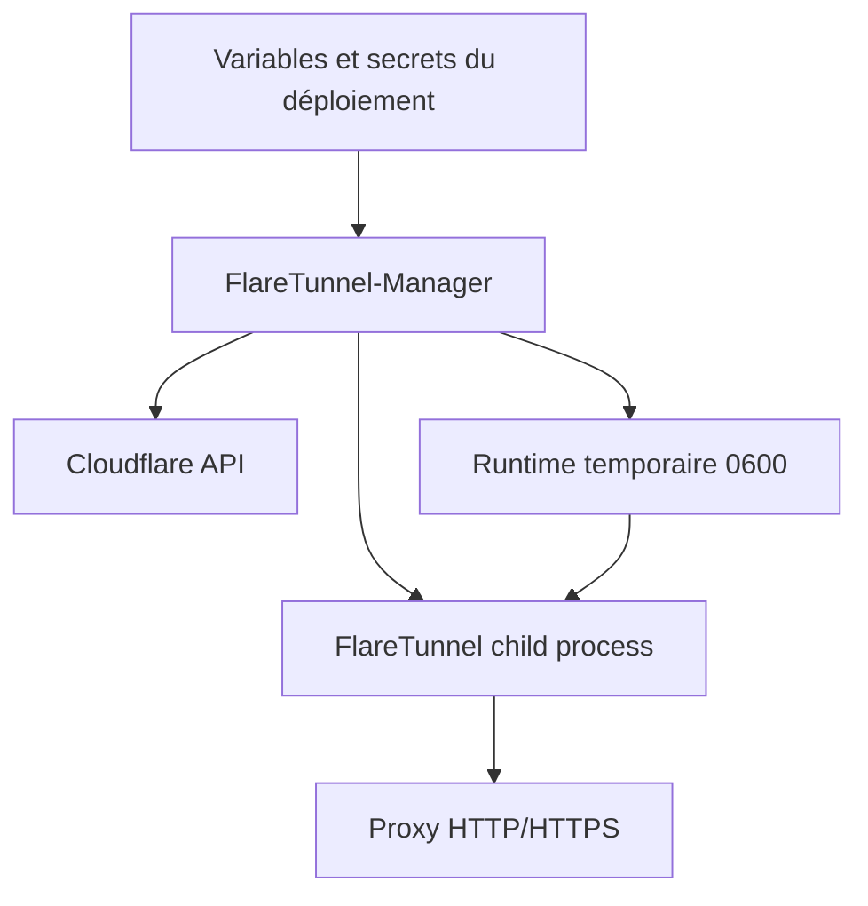

<div align="center">

# FlareTunnel-Manager

**Orchestrateur Go sécurisé pour provisionner, réconcilier et exécuter FlareTunnel dans une image reproductible.**

[](https://go.dev/)
[](https://www.docker.com/)
[](https://developers.cloudflare.com/api/)
[](#modèle-de-sécurité)

**Français · [English](README.en.md)**

</div>

FlareTunnel-Manager sépare l’orchestration Cloudflare du processus proxy FlareTunnel. Il valide la configuration, lit l’état réel des Workers, effectue des opérations bornées, prépare les credentials temporaires et lance FlareTunnel avec un environnement minimal.

L’image Docker est conçue pour être construite une fois puis exécutée sur un poste local, un VPS ou un PaaS compatible OCI.

## Architecture



Le manager ne réimplémente pas les fonctions proxy. Il délègue les commandes de gestion et le tunnel au binaire FlareTunnel construit depuis le commit épinglé dans le `Dockerfile`.

## Fonctionnalités

- **Image reproductible** multi-stage pour Docker, VPS, PaaS et exécution locale.
- **Trois modes explicites** : `create`, `delete` et `use`.
- **Réconciliation avec l’état Cloudflare réel**, en ne comptant que les Workers `flaretunnel-*`.
- **Suppression bornée**, qui ne lance jamais une suppression supérieure à la quantité demandée.
- **Retries contrôlés** et poursuite du traitement des comptes suivants après une erreur.
- **Validation stricte** des tableaux JSON de comptes avant toute opération.
- **Authentification proxy** via `AUTH_PROXY`, convertie en `AUTH_PROXY_BASIC` uniquement pour le child.
- **Certificat MITM et certificat transport séparés**, avec validation clé/certificat.
- **Certificat transport éphémère**, généré à partir des SAN fournis au démarrage.
- **Nettoyage des secrets** et des fichiers de credentials temporaires.
- **Blacklists embarquées** sélectionnées par niveau, sans chemin arbitraire fourni par l’utilisateur.

## Modes de fonctionnement

| Mode | Variable active | Comportement |
| --- | --- | --- |
| `create` | `CF_CREATE_ACCOUNTS` | Atteint `target_workers` Workers `flaretunnel-*` par compte. |
| `delete` | `CF_DELETE_ACCOUNTS` | Supprime le nombre demandé de Workers existants. `target_workers` est une quantité à supprimer. |
| `use` | `CF_USE_ACCOUNTS` | Découvre les endpoints, prépare TLS et lance le proxy de manière persistante. |

Les comptes sont traités séquentiellement. En mode `create`, le manager calcule `missing = target_workers - existing`. En mode `delete`, il limite chaque nettoyage au nombre de Workers effectivement présents.

## Configuration

### Variables obligatoires en mode `use`

```env
MODE=use
AUTH_PROXY={"username":"proxy-user","password":"REPLACE_WITH_A_STRONG_PASSWORD"}
CF_USE_ACCOUNTS=[{"name":"main","api_token":"CLOUDFLARE_API_TOKEN","account_id":"CLOUDFLARE_ACCOUNT_ID"}]
FLARETUNNEL_MITM_CA_KEY_B64=BASE64_ENCODED_RSA_PRIVATE_KEY
FLARETUNNEL_TRANSPORT_CA_KEY_B64=BASE64_ENCODED_RSA_PRIVATE_KEY
FLARETUNNEL_TLS_SAN=proxy.example.com 203.0.113.42
```

Pour `create`, remplacez `CF_USE_ACCOUNTS` par `CF_CREATE_ACCOUNTS` et ajoutez `target_workers`. Pour `delete`, utilisez `CF_DELETE_ACCOUNTS` et interprétez `target_workers` comme le nombre maximal à supprimer.

La référence détaillée des variables et les exemples ligne par ligne se trouvent dans [`DEPLOYMENT_ENV.md`](DEPLOYMENT_ENV.md).

### Objet de compte

```json
[
  {
    "name": "main",
    "api_token": "CLOUDFLARE_API_TOKEN",
    "account_id": "CLOUDFLARE_ACCOUNT_ID",
    "target_workers": 20
  }
]
```

`name`, `api_token` et `account_id` sont requis. `target_workers` est requis en mode `create` et `delete`, et doit être un entier supérieur ou égal à zéro. `zone_id` est facultatif.

### Authentification proxy

`AUTH_PROXY` est un objet JSON strict. Le manager encode `username:password` en Base64 et transmet uniquement la variable interne `AUTH_PROXY_BASIC` au child FlareTunnel.

```text
proxy-user:REPLACE_WITH_A_STRONG_PASSWORD
→ Base64
→ cHJveHktdXNlcjpSRVBMQUNFX1dJVEhfQV9TVFJPTkdfUEFTU1dPUkQ=
```

Ne configurez pas `AUTH_PROXY_BASIC` manuellement. Le secret JSON et sa valeur encodée ne sont jamais écrits dans `flaretunnel.json` ni dans les logs opérationnels.

## TLS et gestion des clés

L’image embarque les certificats publics :

```text
certs/Flaretunnel-MITM-CA.crt
certs/Flaretunnel-TRANSPORT-CA.crt
```

En mode `use`, le manager :

1. valide la clé MITM contre son certificat public ;
2. valide la clé transport contre son certificat public ;
3. génère une clé et un certificat serveur transport éphémères ;
4. injecte uniquement les chemins de fichiers au child ;
5. supprime la clé privée du CA transport dès la signature terminée ;
6. purge les secrets Base64 de l’environnement hérité par le child.

`FLARETUNNEL_TLS_SAN` accepte des noms DNS, des IPv4 et des IPv6 séparés par des espaces. `0.0.0.0` et `::` sont refusées comme identités de certificat.

## Blacklists embarquées

Le runtime contient les fichiers suivants :

| Niveau | Fichier | Usage |
| --- | --- | --- |
| `minimal` | `/opt/flaretunnel/blacklist-minimal.txt` | Navigation générale, économie modérée. |
| `full` | `/opt/flaretunnel/blacklist.txt` | Économie plus forte, risque de ressources manquantes. |
| `aggressive` | `/opt/flaretunnel/blacklist-aggressive.txt` | Automatisation ciblée, rendu navigateur potentiellement cassé. |

Le manager refuse les chemins de blacklist arbitraires et ne supporte pas `FLARETUNNEL_BLACKLIST_DIR`.

## Construction de l’image

Le `Dockerfile` :

1. clone le dépôt FlareTunnel ;
2. vérifie la révision explicitement épinglée dans le `Dockerfile` ;
3. compile FlareTunnel ;
4. compile le manager ;
5. assemble une image Alpine minimale avec certificats publics et blacklists.

```bash
docker build -t flaretunnel-manager:latest .
docker run --rm --env-file .env -p 8080:8080 flaretunnel-manager:latest
```

L’image expose le port `8080` par défaut. En mode `use`, le manager devient FlareTunnel au moyen d’un remplacement de processus ; le conteneur reste donc actif tant que le proxy fonctionne. Les modes `create` et `delete` sont des opérations batch et se terminent après leur résumé.

## Déploiement VPS

Le VPS n’a pas besoin de Go installé : il exécute l’image OCI.

```bash
chmod 600 /secure/path/flaretunnel-manager.env
docker run -d \
  --name flaretunnel-manager \
  --restart unless-stopped \
  --env-file /secure/path/flaretunnel-manager.env \
  -p 8080:8080 \
  IMAGE_REFERENCE
```

## Déploiement PaaS

Configurez les variables et les secrets dans le gestionnaire de secrets du PaaS. Exposez `PORT` selon les contraintes de la plateforme et configurez une health check adaptée au mode `use`. Ne supposez pas que le filesystem est persistant : les credentials et certificats générés sont temporaires.

## Modèle de sécurité

Ne committez jamais de token Cloudflare, de clé privée, de valeur Base64 de clé, d’objet `AUTH_PROXY` réel ou de fichier `.env` de production. Utilisez des permissions de fichier `0600` et le secret manager de la plateforme.

Les tokens Cloudflare doivent avoir les permissions minimales nécessaires à l’opération choisie. Ne désactivez pas la validation TLS côté client et n’utilisez pas `NODE_TLS_REJECT_UNAUTHORIZED=0` dans les systèmes qui consomment le proxy.

Le runtime ne publie pas les secrets dans les logs. En mode `use`, la clé privée du CA transport est supprimée après la génération du certificat serveur et avant le lancement du child.

## Structure du projet

```text
cmd/manager/              Entrée du processus et sélection du mode
internal/business/        Orchestration create/delete/use
internal/ca/              Validation des CA et certificats transport
internal/cloudflare/      Découverte et comptage des Workers
internal/config/          Variables, defaults et validation de mode
internal/flaretunnel/     Contrat d’exécution du binaire FlareTunnel
internal/logging/         Logs avec redaction des secrets
internal/runtime/         Cycle de vie du répertoire temporaire
internal/validation/      Validation des comptes JSON
certs/                    Certificats publics embarqués
Dockerfile                Image multi-stage reproductible
DEPLOYMENT_ENV.md         Référence des variables de déploiement
```

## Développement et vérification

```bash
gofmt -w .
go test ./...
go vet ./...
go build ./cmd/manager
git diff --check
```

Pour vérifier la construction de l’image :

```bash
docker build -t flaretunnel-manager:test .
```

## Licence et responsabilités

Consultez la licence du dépôt et les conditions du projet FlareTunnel utilisé par l’image. L’opérateur est responsable des permissions Cloudflare, des destinations ciblées et de la protection des secrets de déploiement.

## Références

- [Documentation Cloudflare Workers](https://developers.cloudflare.com/workers/ "Cloudflare Workers")
- [Documentation Docker](https://docs.docker.com/ "Docker documentation")
- [FlareTunnel](https://github.com/johndoe237/FlareTunnel "FlareTunnel repository")

---

[Lire cette documentation en anglais](README.en.md)
